## 1\. なぜキャッシュが必要なの？

Webキャッシュは、一言でいうと __「一度見たデータを、手元に取っておく技術」__ です。

皆さんも、一度調べた電話番号をメモしておけば、次からは電話帳を引かずに済みますよね？それと同じです。

Webの世界では、この「メモ」があるおかげで、以下のようなメリットが生まれます。

  * **表示が速くなる！** 🚀: 手元からデータを読み込むので、遠くのサーバーまで取りに行く必要がありません。
  * **サーバーが楽になる！** 💪: みんなが手元のメモを見てくれれば、サーバーへの問い合わせが減り、負荷が下がります。
  * **通信量が節約できる！** 💸: 無駄なデータのやり取りが減ります。
  * **セキュリティが向上する！** 💸: DDos攻撃や不審なアクセスからサーバーを保護できます。


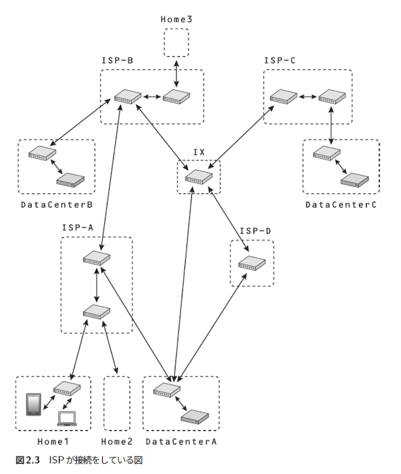
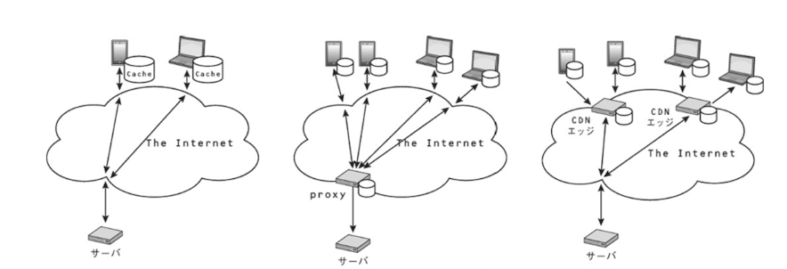
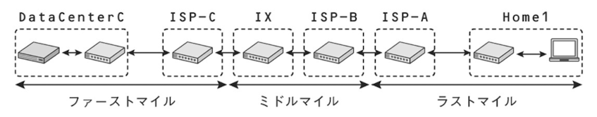


## 2\. データはどんな旅をしてくるの？ (配信経路)

私たちがWebサイトを見るとき、データは下図のようにたくさんのルーターやネットワーク機器を経由して、長い旅をしてきます。この旅の途中の様々な場所に、データを一時的に保管しておく「休憩所」こそがキャッシュサーバーです。

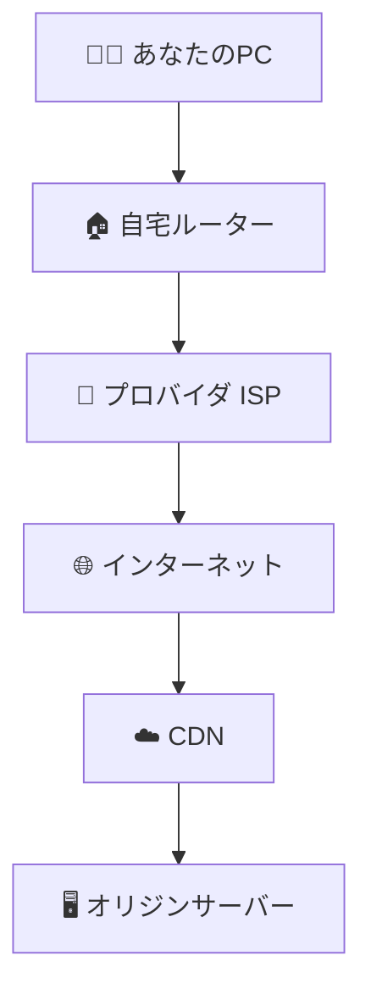
```mermaid
graph TD
    A[👨‍💻 あなたのPC] --> B[🏠 自宅ルーター];
    B --> C[🏢 プロバイダ ISP];
    C --> D[🌐 インターネット];
    D --> E[☁️ CDN];
    E --> F[🖥️ オリジンサーバー];
```

```
traceroutes yahoo.co.jp
```
```
あなたのPC → 自宅ルーター → NURO光のネットワーク → So-netのネットワーク → ... → Yahoo! JAPANのサーバー
```

| No. | 項目 (例) | 名称 | 説明 |
|:---|:---|:---|:---|
| **①** | `5` | **ホップ数 (Hop Count)** | あなたのPCから数えて何番目の中継機器かを示す番号です。 |
| **②** | `ote-gw11po8.net.so-net.ne.jp` | **ホスト名 (Hostname)** | その中継機器に設定されている名前です。多くの場合、所属する組織（ISPなど）がわかるようになっています。応答がない場合は表示されません。 |
| **③** | `(202.213.193.66)` | **IPアドレス (IP Address)** | その中継機器の住所にあたるインターネット上のアドレスです。 |
| **④** | `5.967 ms` | **RTT (Round-Trip Time) 1回目** | 送信したパケットがその機器まで到達し、応答が返ってくるまでにかかった往復時間です。単位はミリ秒（ms）です。 |
| **⑤** | `5.499 ms` | **RTT 2回目** | `traceroute`は正確性を期すために、デフォルトで**3回**パケットを送信します。これは2回目の往復時間です。 |
| **⑥** | `9.108 ms` | **RTT 3回目** | 3回目の往復時間です。ネットワークの混雑状況などにより、時間は毎回少しずつ変動します。 |

### キャッシュはどこにある？

キャッシュは置かれる場所によって、大きく3つに分類できます。

| キャッシュの種類 | 格納場所 | 特徴 |
|:--- |:--- |:--- |
| **ローカルキャッシュ** | 自分のブラウザ | 自分専用のキャッシュ。一番手前にある。 |
| **CDNキャッシュ** | 配信経路上 | 複数人で共有するキャッシュ。高速配信の要。 |
| **ゲートウェイキャッシュ** | オリジンサーバーの手前 | サーバーの負荷を軽減するための最後の砦。 |

### PrivateキャッシュとSharedキャッシュ

キャッシュには、**自分専用**のものと**みんなで共有**するものがあります。

| 種類 | 誰のもの？ | 性質 | 具体例 |
|:--- |:---|:--- |:---|
| **private** | 自分専用 | 特定のユーザーだけが見るデータ。 | ログイン後のマイページ情報 |
| **shared (public)** | みんなで共有 | 誰が見ても同じデータ。 | サイトのロゴ画像、CSSファイル |

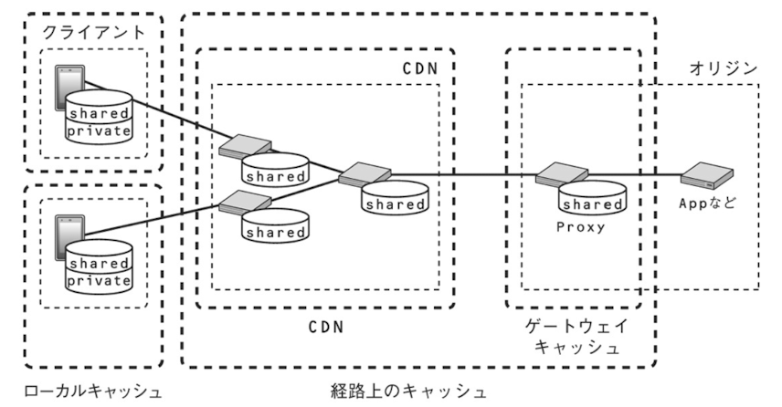
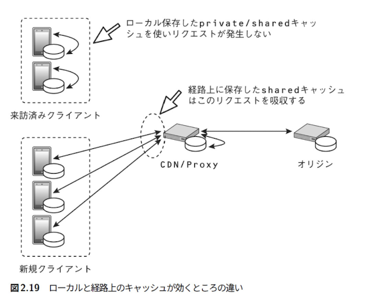
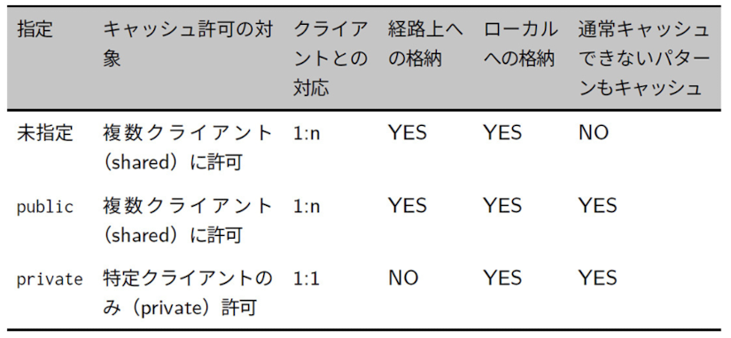

-----

## 3\. 今日学ぶキャッシュ設定の全体像

### 📋 Cache-Controlディレクティブ一覧

| ディレクティブ | 意味 | 具体例 |
|:---|:---|:---|
| **`public`** | 誰でも共有できるキャッシュ（CDN・プロキシOK） | `Cache-Control: public, max-age=3600` |
| **`private`** | 個人専用のキャッシュ（ブラウザのみ） | `Cache-Control: private, max-age=300` |
| **`no-store`** | どこにも保存しない（個人情報向け） | `Cache-Control: private, no-store` |
| **`no-cache`** | 使う前に必ずサーバーに確認 | `Cache-Control: no-cache` |
| **`max-age=秒`** | この秒数の間はキャッシュを使ってOK | `Cache-Control: max-age=3600`（1時間） |
| **`s-maxage=秒`** | CDN・プロキシ専用のmax-age | `Cache-Control: max-age=300, s-maxage=86400` |
| **`must-revalidate`** | 期限切れ後は必ずサーバーに確認 | `Cache-Control: max-age=600, must-revalidate` |
| **`immutable`** | 絶対に変わらないファイル（永久キャッシュ） | `Cache-Control: public, max-age=31536000, immutable` |
| **`stale-while-revalidate=秒`** | 古いキャッシュを返しつつ、裏で非同期更新 | `Cache-Control: max-age=60, stale-while-revalidate=300` |
| **`stale-if-error=秒`** | サーバーエラー時は古いキャッシュで我慢 | `Cache-Control: max-age=600, stale-if-error=86400` |

### 📋 レスポンスヘッダー一覧

| ヘッダー名 | 意味 | 具体例 |
|:---|:---|:---|
| **`Date`** | レスポンスが生成された日時 | `Date: Wed, 21 Oct 2025 07:28:00 GMT` |
| **`Expires`** | この日時まで有効（古い形式） | `Expires: Wed, 21 Oct 2025 08:28:00 GMT` |
| **`Age`** | CDNに保存されていた時間（秒） | `Age: 300`（5分間キャッシュされていた） DateからExpiresまでの期間|
| **`ETag`** | ファイルの内容から生成される「指紋」 | `ETag: "33a64df551425fcc55e"` |
| **`Last-Modified`** | ファイルの最終更新日時 | `Last-Modified: Mon, 12 Oct 2025 13:00:00 GMT` |
| **`Vary`** | キャッシュをグループ化するヘッダーを指定 | `Vary: Accept-Encoding, Accept-Language` |
| **`Pragma`** | 古いno-cache（HTTP/1.0時代の遺産）あんまり気にしなくても良いかも | `Pragma: no-cache` |

### 📋 リクエストヘッダー一覧（条件付きリクエスト）

| ヘッダー名 | 意味 | サーバーの応答 |
|:---|:---|:---|
| **`If-None-Match`** | このETagのファイル、変わってない？ | 一致 → `304 Not Modified`<br>不一致 → `200 OK`（新データ） |
| **`If-Modified-Since`** | この日時以降に更新された？ | 更新なし → `304 Not Modified`<br>更新あり → `200 OK`（新データ） |

### 🎯 よく使う組み合わせパターン

| 用途 | 設定例 |
|:---|:---|
| **静的アセット（バージョン付き）** | `Cache-Control: public, max-age=31536000, immutable`<br>`ETag: "abc123"` |
| **HTML（常に最新）** | `Cache-Control: no-cache`<br>`ETag: "xyz789"`<br>`Last-Modified: ...` |
| **個人情報API** | `Cache-Control: private, no-store` |
| **ニュースサイト** | `Cache-Control: public, max-age=60, stale-while-revalidate=300` |
| **動画配信** | `Cache-Control: public, max-age=3600, s-maxage=2592000` |

**💡 ここからの講義で、これらすべての意味と使い方を習得しましょう！**

-----

## 4\. キャッシュの「鮮度」管理：`ETag`と`Last-Modified`

キャッシュを効率的に使うには、「このキャッシュ、まだ使える？それとも古くなった？」を判断する仕組みが必要です。
この鮮度確認のために使われるのが**`ETag`（イータグ）**と**`Last-Modified`**です。

### `ETag`：ファイルの「指紋」

`ETag`は**ファイルの内容から生成されるユニークな識別子**です。まるで指紋のように、ファイルが少しでも変われば`ETag`も変わります。

| ヘッダー名 | 意味 | 例 |
|:---|:---|:---|
| **`ETag`** | ファイルの内容から生成される識別子（ハッシュ値） | `ETag: "33a64df551425fcc55e"` |
| **`Last-Modified`** | リソースの最終更新日時 | `Last-Modified: Mon, 12 Oct 2025 13:00:00 GMT` |

### AWS S3の`ETag`はMD5ハッシュ

S3に保存されたファイルの`ETag`は、通常**ファイルのMD5ハッシュ値**です。これを実際に確認してみましょう！

#### ステップ1: S3のETagを確認

```bash
aws s3api head-object --bucket my-bucket --key data.json --profile my-profile
```

**レスポンス例**:
```json
{
    "AcceptRanges": "bytes",
    "LastModified": "2025-09-30T11:24:58+00:00",
    "ContentLength": 2967,
    "ETag": "\"c4fc111feb111e1a1f333c0d1b12345c\"",
    "VersionId": "lrDOb_uaVF5aaPaaa6OHQD3aTSSaaWaH",
    "ContentType": "application/json",
    "ServerSideEncryption": "AES256",
    "Metadata": {}
}
```

**注目**: `ETag: "c4fc111feb111e1a1f333c0d1b12345c"` ← これがファイルの指紋！

#### ステップ2: ファイルをダウンロード

```bash
aws s3 cp s3://my-bucket/data.json . --profile my-profile
```

#### ステップ3: MD5ハッシュを計算

```bash
md5 data.json
```

**出力**:
```
MD5 (data.json) = c4fc111feb111e1a1f333c0d1b12345c
```

**✅ S3のETagと一致しました！**

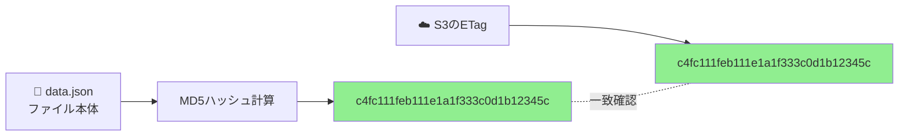
```mermaid
flowchart LR
    A[📄 data.json<br>ファイル本体] --> B[MD5ハッシュ計算]
    B --> C[c4fc111feb111e1a1f333c0d1b12345c]
    D[☁️ S3のETag] --> E["c4fc111feb111e1a1f333c0d1b12345c"]
    C -.一致確認.- E
    style C fill:#90EE90
    style E fill:#90EE90
```

### なぜこれが重要なのか？

この一致確認により、以下のことが保証されます：

1. **整合性の検証**: ダウンロードしたファイルが破損していないか確認できる
2. **キャッシュの信頼性**: ブラウザがキャッシュしたファイルが正しいか判断できる
3. **効率的な配信**: CDNやブラウザが「このファイル、すでに持ってる！」と判断できる

⚠️ **注意**: マルチパートアップロードしたファイルのETagは `"hash-パート数"` という形式になり、単純なMD5ではなくなります。

### 条件付きリクエスト：「変わってない？」と確認する

ブラウザは、キャッシュしたファイルがまだ新鮮かどうかをサーバーに確認する際に、このEtagとLast-Modifiedの値を使って、次のヘッダーに設定して使用する。

| リクエストヘッダー | 意味 | サーバーの判断 |
|:---|:---|:---|
| **`If-None-Match: "abc123"`** | この`ETag`のファイル、変わってない？ | 一致 → `304 Not Modified`<br>不一致 → `200 OK`（新データ送信） |
| **`If-Modified-Since: Mon, 12 Oct 2025 13:00:00 GMT`** | この日時以降に更新された？ | 更新なし → `304 Not Modified`<br>更新あり → `200 OK`（新データ送信） |

**💡 `If-None-Match`（ETag）の方が正確**
- `Last-Modified`は秒単位なので、1秒以内に複数回更新されると検知できない
- `ETag`は内容が変われば必ず変わるので、確実に変更を検知できる

### 条件付きリクエストの流れ（`If-None-Match`編）

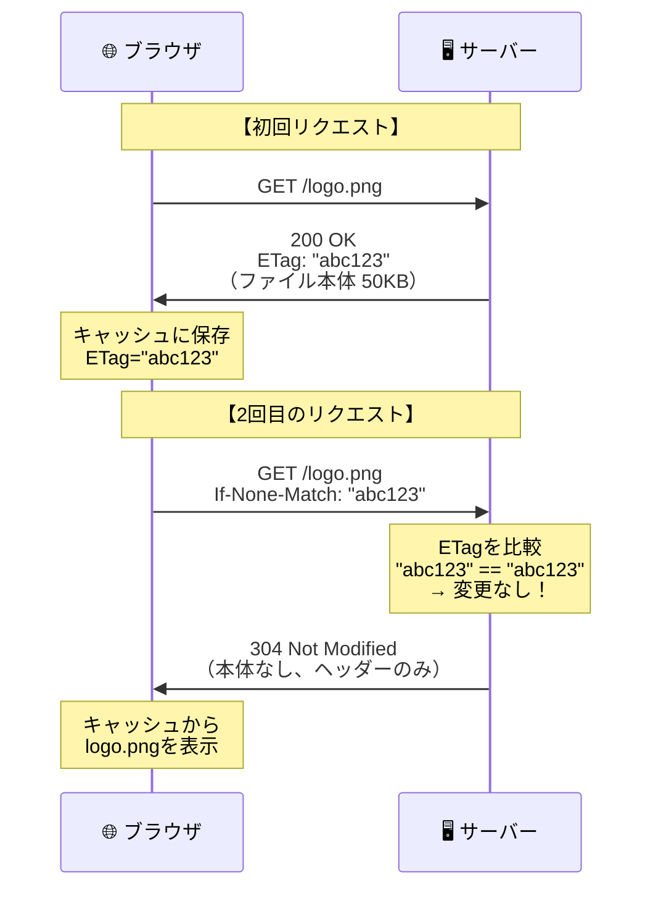
```mermaid
sequenceDiagram
    participant Browser as 🌐 ブラウザ
    participant Server as 🖥️ サーバー

    Note over Browser, Server: 【初回リクエスト】
    Browser->>Server: GET /logo.png
    Server->>Browser: 200 OK<br>ETag: "abc123"<br>（ファイル本体 50KB）
    Note over Browser: キャッシュに保存<br>ETag="abc123"

    Note over Browser, Server: 【2回目のリクエスト】
    Browser->>Server: GET /logo.png<br>If-None-Match: "abc123"
    Note over Server: ETagを比較<br>"abc123" == "abc123"<br>→ 変更なし！
    Server->>Browser: 304 Not Modified<br>（本体なし、ヘッダーのみ）
    Note over Browser: キャッシュから<br>logo.pngを表示
```

**通信量の削減効果**
- 初回：50KB（ファイル本体）
- 2回目：数百バイト（ヘッダーのみ）
- **約99%の通信量削減！**

-----

## 4\. キャッシュを操る：`Cache-Control`ヘッダー
__Cache-Controlは、「条件付きリクエスト」（答え合わせ）を「いつ実行するか、または実行しないか」を決定する、「指令」__

では、どうやってキャッシュを制御するのでしょうか？
答えは、サーバーが返す**HTTPレスポンスヘッダー**にあります。特に重要なのが`Cache-Control`というヘッダーで、ここに「ディレクティブ」を書くことで、キャッシュの振る舞いを細かく指示できます。

```
Cache-Control: private, no-store
```
```
Cache-Control: no-cache
```
```
Cache-Control: public, max-age=3600
```
みたいに指定する。

## 5\. まず覚えたい！基本３選

| ディレクティブ | 効果 | こんな時に使う | 具体例 |
|:---|:---|:---|:---|
| **`no-store`** | **キャッシュ完全禁止！** 🚫 | 個人情報など、絶対に保存されたくない情報 | `Cache-Control: private, no-store` |
| **`no-cache`** | **毎回サーバーに確認して！** 📡 | 常に最新にしたいHTMLファイルなど | `Cache-Control: no-cache` |
| **`max-age=N`** | **N秒間はキャッシュしてOK！** ⏱️ | 画像やCSSなど、頻繁に更新しないファイル | `Cache-Control: public, max-age=3600` |

### `no-cache`の動きを見てみよう！

`no-cache`は「キャッシュするな」ではなく「**使う前に必ず確認しろ**」という意味です。

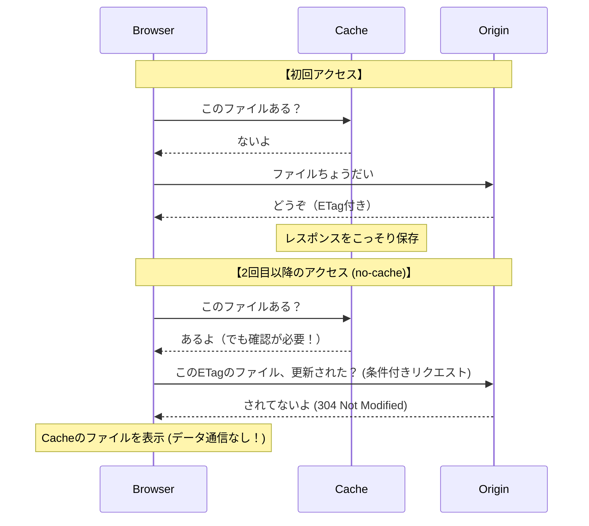
```mermaid
sequenceDiagram
    participant Browser
    participant Cache
    participant Origin

    Note over Browser, Origin: 【初回アクセス】
    Browser->>Cache: このファイルある？
    Cache-->>Browser: ないよ
    Browser->>Origin: ファイルちょうだい
    Origin-->>Browser: どうぞ（ETag付き）
    Note over Cache: レスポンスをこっそり保存

    Note over Browser, Origin: 【2回目以降のアクセス (no-cache)】
    Browser->>Cache: このファイルある？
    Cache-->>Browser: あるよ（でも確認が必要！）
    Browser->>Origin: このETagのファイル、更新された？ (条件付きリクエスト)
    Origin-->>Browser: されてないよ (304 Not Modified)
    Note over Browser: Cacheのファイルを表示 (データ通信なし！)
```
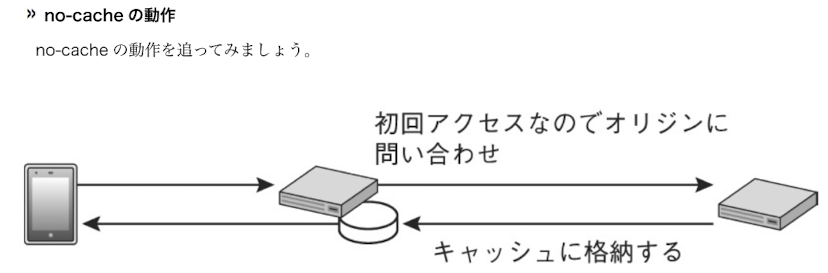
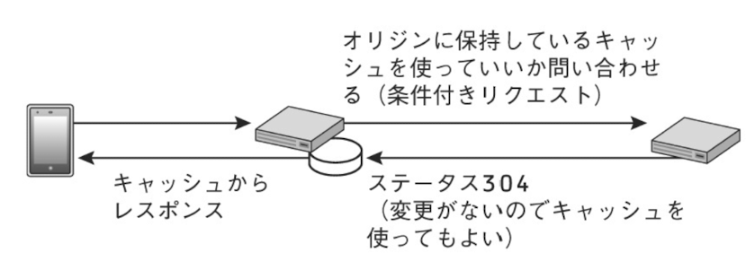
-----

## 6\. そのほかのディレクティブ

基本の3つを覚えたら、次はもっと高度な制御を見ていきましょう。

| ディレクティブ | 効果 | 具体例 |
|:---|:---|:---|
| `must-revalidate` | **時間制限付きの`no-cache`**。期限が切れたら必ずサーバーに確認する。 | `Cache-Control: max-age=3600, must-revalidate` |
| `s-maxage` | **Shared Cache（CDN・プロキシ）専用のmax-age**。`max-age`はブラウザ用、`s-maxage`はCDN用と分けられる。CDNで長期キャッシュすることで、オリジンサーバーへのリクエストを激減させつつ、ブラウザでは短めにして最新版を素早く配信できる。大容量ファイル配信で真価を発揮。 | `Cache-Control: max-age=300, s-maxage=86400` |
| `immutable` | **絶対不変！** ファイル名にバージョンを含むJS/CSS (`app.v3.js`) などに使うと最強。 | `Cache-Control: public, max-age=31536000, immutable` |
| `stale-while-revalidate` | **とりあえず古いの見せとくから、裏で更新しといて！** ユーザーの体感速度UP！ | `Cache-Control: max-age=60, stale-while-revalidate=300` |
| `stale-if-error` | **サーバーが死んだら、古いやつで我慢して！** 障害時の保険。 | `Cache-Control: max-age=600, stale-if-error=86400` |

### `must-revalidate`は「時間制限付き`no-cache`」

この例えが一番しっくりきます。`max-age`の期間中はサーバーに確認せず、切れた瞬間に`no-cache`と同じ動きになります。
must-revalidateをつけなくても、max-ageが切れたらオリジンへ向かう想定だが、必ずしもそうとはいえない。したがって、確実にオリジンへ向かうような設定と言える。

must-revalidate は、CDNやブラウザに対する「ルールを（何があっても）絶対に守れ」という強力な指示です。

> #### must-revalidate が無い場合 (デフォルト)
> - max-age が切れたら: Nginxはオリジンに「更新ある？」と確認（304 チェック）に向かいます。（これが「想定」）
> - しかし: もしオリジン（Flask）がダウンしていて応答がない場合、Nginx の設定 (proxy_cache_use_stale error; など) 次第では、「仕方ないから、古いキャッシュで我慢してもらおう」と、期限切れのデータを返してしまうことが 可能 です。
> - （= max-age が切れても、必ずしもオリジンへの確認が成功するとは限らないし、古いデータを返してしまう**「例外」**があり得る）

> #### must-revalidate が有る場合
> - max-age が切れたら: Nginxはオリジンに確認に向かいます。
> - もしオリジンがダウンしていたら: Nginxは must-revalidate の指示を思い出し、「古いキャッシュを勝手に使うことは絶対に許されない」と判断します。
> - Nginxは、期限切れのデータを返すことを拒否し、クライアント（ブラウザ）に 504 Gateway Timeout (エラー) を返します。


| 振る舞い | `Cache-Control: max-age=60, must-revalidate` | `Cache-Control: no-cache` |
|:---|:---|:---|
| **有効期限内** (0〜60秒) | **サーバーに確認しない**<br>(キャッシュをそのまま使う) | **サーバーに確認する**<br>(毎回問い合わせる) |
| **有効期限後** (60秒〜) | **サーバーに確認する** | **サーバーに確認する** |

### `stale-while-revalidate`の優しい世界

ユーザーを待たせずに、裏でこっそりコンテンツを更新する動きです。

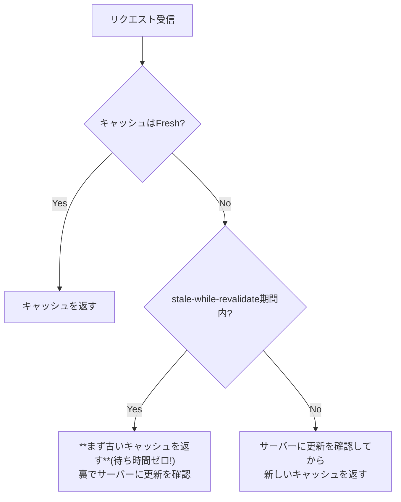
```mermaid
flowchart TD
    A[リクエスト受信] --> B{キャッシュはFresh?};
    B -- Yes --> C[キャッシュを返す];
    B -- No --> D{stale-while-revalidate期間内?};
    D -- Yes --> E["**まず古いキャッシュを返す**(待ち時間ゼロ!)<br>裏でサーバーに更新を確認"];
    D -- No --> F[サーバーに更新を確認してから<br>新しいキャッシュを返す];
```
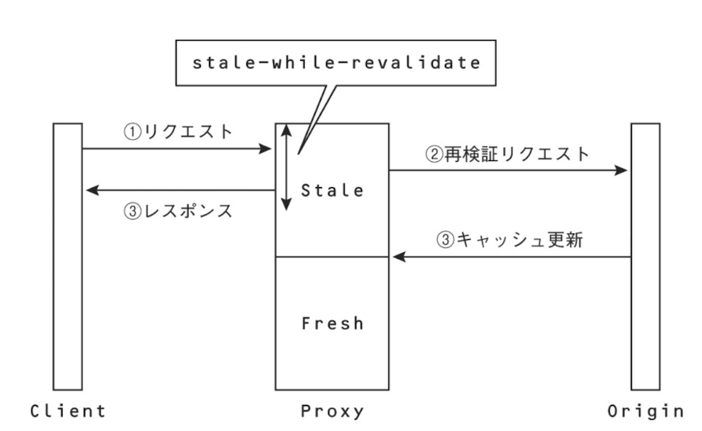

### `s-maxage`の使い分け戦略

`s-maxage`は、**ブラウザとCDNで異なるキャッシュ期間を設定**できる強力なディレクティブです。

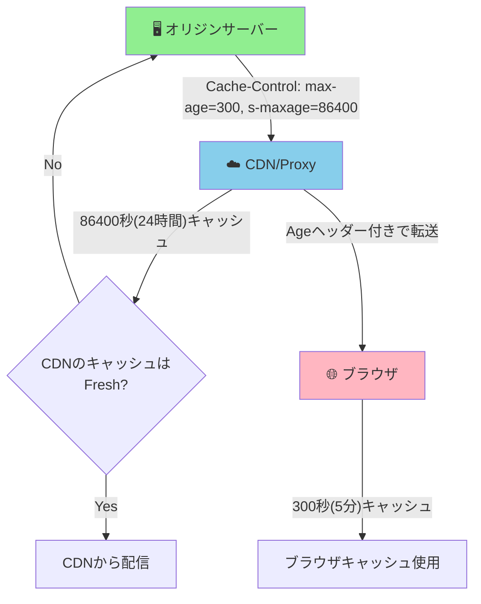
```mermaid
flowchart TD
    A[🖥️ オリジンサーバー] -->|"Cache-Control: max-age=300, s-maxage=86400"| B[☁️ CDN/Proxy]
    B -->|"86400秒(24時間)キャッシュ"| C{CDNのキャッシュは<br>Fresh?}
    C -- Yes --> D[CDNから配信]
    C -- No --> A
    B -->|"Ageヘッダー付きで転送"| E[🌐 ブラウザ]
    E -->|"300秒(5分)キャッシュ"| F[ブラウザキャッシュ使用]

    style B fill:#87CEEB
    style E fill:#FFB6C1
    style A fill:#90EE90
```

**なぜこの使い分けが効果的？**

| 場所 | キャッシュ期間 | 理由 |
|:---|:---|:---|
| **CDN** | 長め（s-maxage） | 大容量ファイルは何度もオリジンから取得するとコストと負荷が高い。CDNに長期保存してグローバル配信 |
| **ブラウザ** | 短め（max-age） | 更新があった場合、ブラウザは比較的早く新しい版を取得できる。CDNまで取りに行けば良いので速い |

**具体例**: 動画ファイル配信
```http
Cache-Control: public, max-age=3600, s-maxage=2592000
```
- ブラウザ：1時間で期限切れ → CDNに再確認（速い！）
- CDN：30日間保存 → オリジンへの負荷が激減

### `stale-if-error`の保険システム

サーバーがダウンしても、古いキャッシュで凌ぐことができる「災害対策」のディレクティブです。

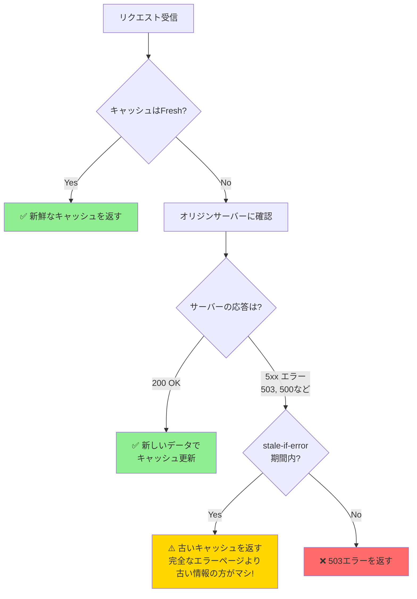
```mermaid
flowchart TD
    A[リクエスト受信] --> B{キャッシュはFresh?}
    B -- Yes --> C[✅ 新鮮なキャッシュを返す]
    B -- No --> D[オリジンサーバーに確認]
    D --> E{サーバーの応答は?}
    E -- 200 OK --> F[✅ 新しいデータで<br>キャッシュ更新]
    E -- "5xx エラー<br>503, 500など" --> G{stale-if-error<br>期間内?}
    G -- Yes --> H["⚠️ 古いキャッシュを返す<br>完全なエラーページより<br>古い情報の方がマシ!"]
    G -- No --> I[❌ 503エラーを返す]

    style C fill:#90EE90
    style F fill:#90EE90
    style H fill:#FFD700
    style I fill:#FF6B6B
```
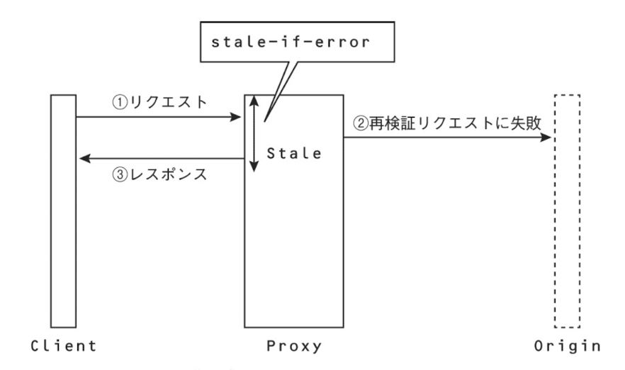

**典型的な使用例**: サービス紹介ページ
```http
Cache-Control: public, max-age=600, stale-if-error=86400
```

**タイムライン**:
```
0秒〜600秒: 新鮮なキャッシュを使用
600秒〜: オリジンに確認
  → サーバーが正常: 新しいデータで更新
  → サーバーがエラー: 600秒〜86400秒(24時間)の間は古いキャッシュを返す
```

**効果**:
- サーバー障害時でも「ページが見れない！」を回避
- メンテナンス中も最低限の情報を提供できる
- BCP（事業継続計画）の一環として有効

**⚠️ 注意点**:
- 「古い情報でも見れた方がマシ」なコンテンツに使う（ニュース速報には不向き）
- 決済・認証など、正確性が最優先のAPIには使わない
-----

## 7\. CDNの内部動作：キャッシュ処理フローの詳細

ここまでCache-Controlディレクティブについて学んできましたが、実際にCDNやProxyサーバーの内部で**どのようにキャッシュが処理されているのか**を理解すると、より深く設定の意味がわかるようになります。

### 7.1 トランザクションの独立性

CDN/Proxyは**サーバーでもあり、クライアントでもある**という二面性を持ちます。重要なのは、この2つの役割が**独立したトランザクション**として処理されることです。

| トランザクション | 役割 | 説明 |
|:---|:---|:---|
| **Client Trx**<br>（クライアントトランザクション） | サーバーとして動作 | ブラウザとやり取りし、レスポンスを返す |
| **Origin Trx**<br>（オリジントランザクション） | クライアントとして動作 | オリジンサーバーにリクエストを送り、データを取得 |

この独立性により、`stale-while-revalidate`のように**クライアントには古いキャッシュをすぐ返しつつ、裏で非同期にオリジンから更新を取得**することが可能になります。

### 7.2 イベントの流れ：RxReq → TxReq → RxResp → TxResp

CDN/Proxyでは、リクエスト/レスポンスの処理が**4つの主要なイベント**で構成されています。

**イベント名の読み方**:
- **Rx** = Receive（受信）
- **Tx** = Transmit（送信）
- **Req** = Request（リクエスト）
- **Resp** = Response（レスポンス）

| イベント | タイミング | 説明 |
|:---|:---|:---|
| **RxReq** | クライアントからリクエストを受信 | ACL処理、キャッシュキーの決定、キャッシュ可否判定（1回目） |
| **Cache Lookup** | キャッシュの有無を判定 | キャッシュキーとVaryを使ってヒット/ミスを判断 |
| **TxReq** | オリジンへリクエストを送信 | オリジン選択、パスのリライト |
| **RxResp** | オリジンからレスポンスを受信 | TTL設定、キャッシュ可否判定（2回目）、Set-Cookie削除 |
| **TxResp** | クライアントへレスポンスを送信 | CORS対応、不要ヘッダの削除 |

### 7.3 キャッシュヒット時のフロー

キャッシュがヒットした場合、オリジンへのリクエストは発生しません。

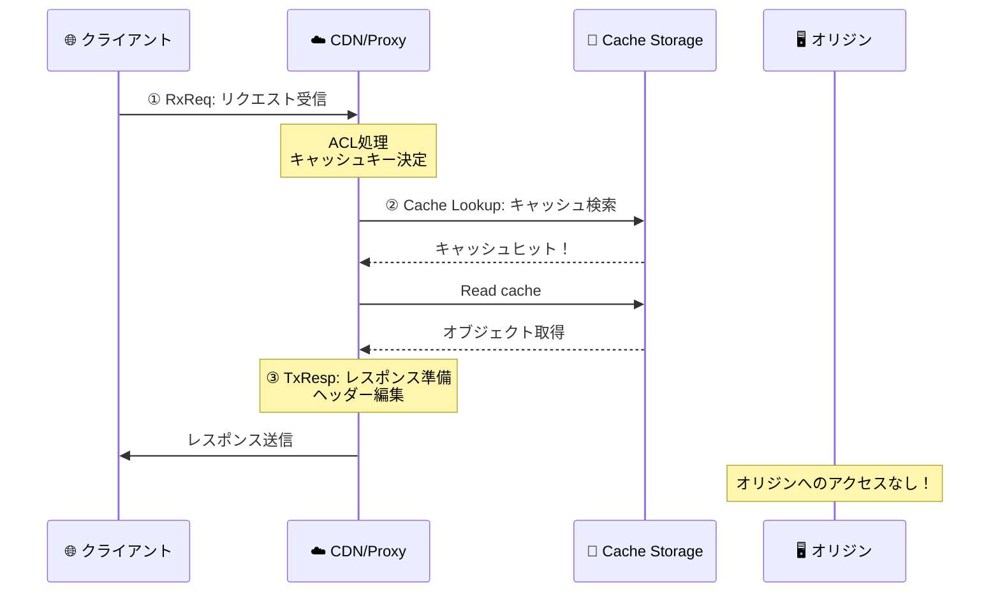
```mermaid
sequenceDiagram
    participant Client as 🌐 クライアント
    participant CDN as ☁️ CDN/Proxy
    participant Cache as 💾 Cache Storage
    participant Origin as 🖥️ オリジン

    Client->>CDN: ① RxReq: リクエスト受信
    Note over CDN: ACL処理<br>キャッシュキー決定
    CDN->>Cache: ② Cache Lookup: キャッシュ検索
    Cache-->>CDN: キャッシュヒット！
    CDN->>Cache: Read cache
    Cache-->>CDN: オブジェクト取得
    Note over CDN: ③ TxResp: レスポンス準備<br>ヘッダー編集
    CDN->>Client: レスポンス送信

    Note over Origin: オリジンへのアクセスなし！
```

**処理の流れ**:
1. **RxReq**: クライアントからリクエストを受信し、キャッシュキーを決定
2. **Cache Lookup**: キャッシュストレージから該当するオブジェクトを検索 → **ヒット！**
3. **TxResp**: キャッシュからオブジェクトを読み出し、必要に応じてヘッダーを編集してレスポンス
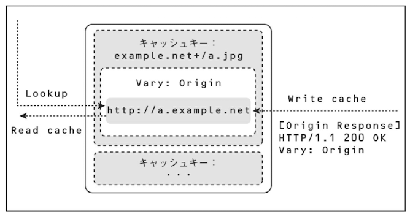
### 7.4 キャッシュミス時のフロー

キャッシュがない場合、オリジンへ問い合わせが発生します。

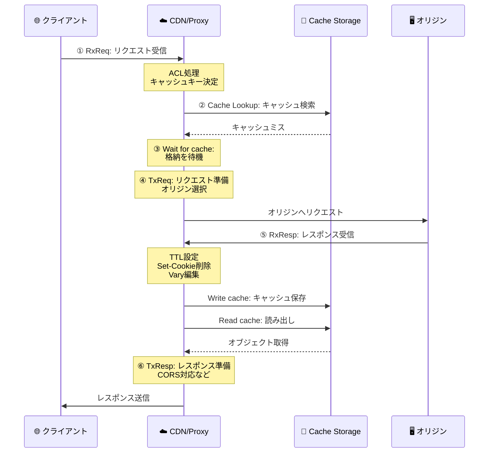
```mermaid
sequenceDiagram
    participant Client as 🌐 クライアント
    participant CDN as ☁️ CDN/Proxy
    participant Cache as 💾 Cache Storage
    participant Origin as 🖥️ オリジン

    Client->>CDN: ① RxReq: リクエスト受信
    Note over CDN: ACL処理<br>キャッシュキー決定
    CDN->>Cache: ② Cache Lookup: キャッシュ検索
    Cache-->>CDN: キャッシュミス
    Note over CDN: ③ Wait for cache:<br>格納を待機
    Note over CDN: ④ TxReq: リクエスト準備<br>オリジン選択
    CDN->>Origin: オリジンへリクエスト
    Origin->>CDN: ⑤ RxResp: レスポンス受信
    Note over CDN: TTL設定<br>Set-Cookie削除<br>Vary編集
    CDN->>Cache: Write cache: キャッシュ保存
    CDN->>Cache: Read cache: 読み出し
    Cache-->>CDN: オブジェクト取得
    Note over CDN: ⑥ TxResp: レスポンス準備<br>CORS対応など
    CDN->>Client: レスポンス送信
```

**処理の流れ**:
1. **RxReq**: リクエスト受信、キャッシュキー決定
2. **Cache Lookup**: キャッシュ検索 → **ミス**
3. **Wait for cache**: 同一リクエストがある場合は待機（後述）
4. **TxReq**: オリジンへリクエストを送信
5. **RxResp**: オリジンからレスポンスを受信し、キャッシュストレージに保存
6. **TxResp**: キャッシュから読み出してクライアントへレスポンス

### 7.5 Wait for cache：同一リクエストのまとめ上げ

SNSでバズった時など、**同一のリクエストが大量に殺到**することがあります。このとき、すべてのリクエストをオリジンに転送すると負荷が爆発します。

**Wait for cacheの仕組み**:

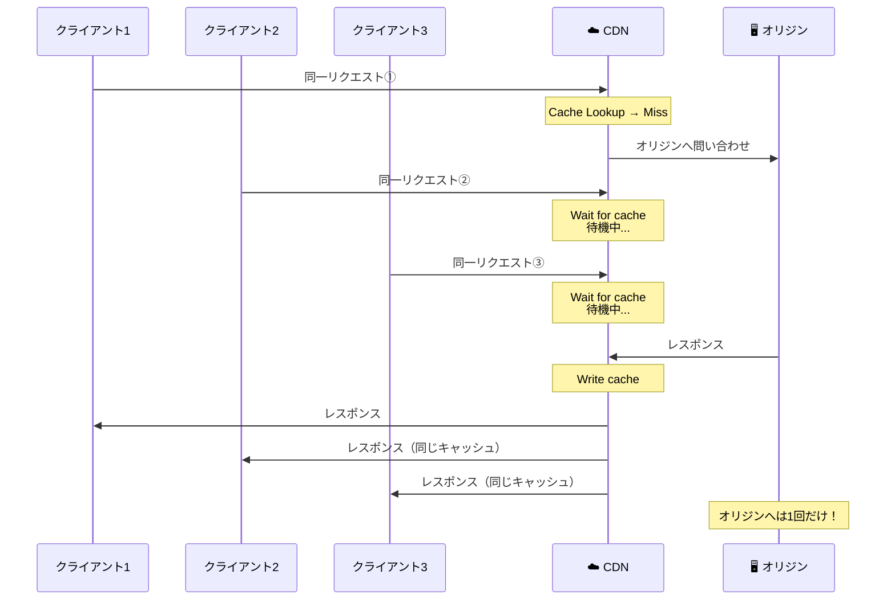
```mermaid
sequenceDiagram
    participant C1 as クライアント1
    participant C2 as クライアント2
    participant C3 as クライアント3
    participant CDN as ☁️ CDN
    participant Origin as 🖥️ オリジン

    C1->>CDN: 同一リクエスト①
    Note over CDN: Cache Lookup → Miss
    CDN->>Origin: オリジンへ問い合わせ
    C2->>CDN: 同一リクエスト②
    Note over CDN: Wait for cache<br>待機中...
    C3->>CDN: 同一リクエスト③
    Note over CDN: Wait for cache<br>待機中...
    Origin->>CDN: レスポンス
    Note over CDN: Write cache
    CDN->>C1: レスポンス
    CDN->>C2: レスポンス（同じキャッシュ）
    CDN->>C3: レスポンス（同じキャッシュ）

    Note over Origin: オリジンへは1回だけ！
```

**効果**:
- 100個の同一リクエストが来ても、オリジンへは**1回だけ**問い合わせ
- 残りの99個は待機して、キャッシュ保存完了後にまとめて配信

**⚠️ 注意点**: キャッシュできないページ（マイページなど）でこの機能が有効だと、無駄に待機時間が発生してパフォーマンスが悪化します。`Cache-Control: private, no-store`などで明示的にキャッシュ不可を指定しましょう。

### 7.6 各イベントで行う主な処理

#### RxReq（クライアントからリクエスト受信時）

**このイベントの特徴**: すべてのリクエストで**必ず呼ばれる**

| 処理内容 | 説明 | 具体例 |
|:---|:---|:---|
| **ACL処理** | アクセス制限の判定 | 特定IPからのみアクセス許可 |
| **キャッシュキーの決定** | Cache Lookupで使うキーを生成 | ホスト名＋URLパス＋Cookie値 |
| **Varyセカンダリキーの設定** | リクエストヘッダーから値を抽出 | `Accept-Encoding`の正規化 |
| **キャッシュ可否判定（1回目）** | リクエスト内容から判定 | POSTメソッドはキャッシュしない |
| **不要なヘッダー削除** | Cookieなどのフィルタリング | ユーザー追跡Cookieを削除 |

**コード例**（Varnish VCL）:
```vcl
sub vcl_recv {
  # ACL処理
  if (client.ip !~ allowed_ips) {
    return (synth(403, "Forbidden"));
  }

  # キャッシュキーにCookieの特定値を追加
  if (req.http.Cookie ~ "device=") {
    set req.http.X-Device = regsub(req.http.Cookie, ".*device=([^;]+).*", "\1");
  }

  # POSTはキャッシュしない
  if (req.method == "POST") {
    return (pass);
  }
}
```

#### Cache Lookup（キャッシュヒット判定）

**判定フロー**:
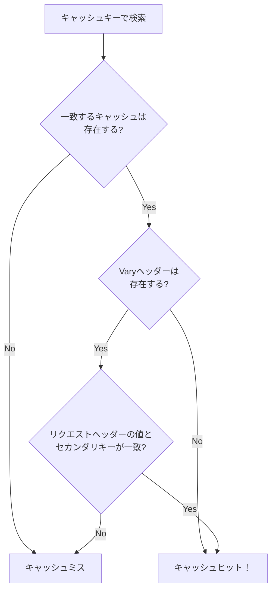
```mermaid
flowchart TD
    A[キャッシュキーで検索] --> B{一致するキャッシュは<br>存在する?}
    B -- No --> C[キャッシュミス]
    B -- Yes --> D{Varyヘッダーは<br>存在する?}
    D -- No --> E[キャッシュヒット！]
    D -- Yes --> F{リクエストヘッダーの値と<br>セカンダリキーが一致?}
    F -- Yes --> E
    F -- No --> C
```

**ポイント**:
- キャッシュに保存されている`Vary`ヘッダーを使って判定
- セカンダリキーの値はリクエストヘッダーから取得
- `Vary: Accept-Encoding`なら、リクエストの`Accept-Encoding: gzip`とキャッシュのセカンダリキー`gzip`が一致するか確認

#### TxReq（オリジンへリクエスト送信時）

| 処理内容 | 説明 | 具体例 |
|:---|:---|:---|
| **オリジン選択** | 複数オリジンから選択 | `/api/*`は API サーバー、`/static/*`は静的ファイルサーバー |
| **パスのリライト** | キャッシュキーに影響させずに変更 | `/v2/users/123` → `/users/123?version=2` |
| **コスト削減のためのヘッダー編集** | イベント呼び出しコストが高い場合 | Lambda@EdgeでTxReqにまとめる |

**キャッシュキーへの影響**:
- RxReqで編集 → キャッシュキーに**影響する**
- TxReqで編集 → キャッシュキーに**影響しない**（Cache Lookupの後だから）

#### RxResp（オリジンからレスポンス受信時）

**このイベントの特徴**: キャッシュストレージに保存する**直前**の処理

| 処理内容 | 説明 | 具体例 |
|:---|:---|:---|
| **キャッシュ可否判定（2回目）** | レスポンスから判定 | `Cache-Control: no-store`ならキャッシュしない |
| **TTL設定** | キャッシュの有効期限を上書き | 404は10秒だけキャッシュ |
| **Set-Cookie削除** | キャッシュに含めると危険 | 個人情報の漏洩を防止 |
| **Varyヘッダー編集** | セカンダリキーの設定 | `Vary: x-device`を追加 |

**コード例**:
```vcl
sub vcl_backend_response {
  # 404は短くキャッシュ
  if (beresp.status == 404) {
    set beresp.ttl = 10s;
  }

  # キャッシュする場合はSet-Cookieを削除
  if (beresp.ttl > 0s) {
    unset beresp.http.Set-Cookie;
  }

  # デバイス判定用のVaryを追加
  if (bereq.http.X-Device) {
    set beresp.http.Vary = "X-Device";
  }
}
```

#### TxResp（クライアントへレスポンス送信時）

**このイベントの特徴**: レスポンスする**直前**の最終調整

| 処理内容 | 説明 | 具体例 |
|:---|:---|:---|
| **CORS対応** | クライアントごとに異なるヘッダー | `Access-Control-Allow-Origin`を動的生成 |
| **Age削除** | 不要な内部ヘッダーの削除 | クライアントキャッシュへの影響を防ぐ |
| **内部用ヘッダーのクリーンアップ** | 処理用に追加したヘッダーを削除 | `X-Device`などを除去 |

**CORS対応の例**:
```vcl
sub vcl_deliver {
  # Varyはキャッシュヒット判定に使わず、クライアントにのみ通知
  set resp.http.Vary = "Origin";

  # クライアントのOriginに応じてAccess-Control-Allow-Originを生成
  if (req.http.Origin ~ "^https://(www\.)?example\.com$") {
    set resp.http.Access-Control-Allow-Origin = req.http.Origin;
  }
}
```

### 7.7 Varyとセカンダリキーの複雑な関係

Varyとキャッシュキーでは、編集するタイミングが異なるため注意が必要です。

**Varyを使ったキャッシュの出し分け手順**:

| ステップ | イベント | 処理内容 |
|:---|:---|:---|
| 1 | **RxReq** | デバイス判定を行い、`X-Device: pc`をリクエストヘッダーに追加（セカンダリキー） |
| 2 | Cache Lookup | `X-Device`の値でキャッシュを検索 |
| 3 | **TxReq** | オリジンへ送る前に`X-Device`を削除（オプション） |
| 4 | **RxResp** | レスポンスに`Vary: X-Device`を追加 |
| 5 | Cache Storage | `Vary: X-Device`と`X-Device: pc`をセットでキャッシュに保存 |
| 6 | **TxResp** | クライアントに返す前に`Vary`を編集（必要なら`User-Agent`に変更） |

**ポイント**:
- **セカンダリキー**（`X-Device: pc`）の編集 → **RxReq**（Cache Lookupの前）
- **Varyヘッダー**（`Vary: X-Device`）の編集 → **RxResp**（キャッシュ保存の前）

-----

## 8\. キャッシュ関連のレスポンスヘッダー全集

`Cache-Control`以外にも、キャッシュに関わる重要なヘッダーがたくさんあります。

### 時間を示すヘッダー

| ヘッダー名 | 意味 | 例 |
|:---|:---|:---|
| **`Date`** | **レスポンスが生成された日時**。キャッシュの起点となる。 | `Date: Wed, 21 Oct 2025 07:28:00 GMT` |
| **`Expires`** | **この日時まで有効**という古い形式（HTTP/1.0時代）。`Cache-Control: max-age`がある場合はそちらが優先される。 | `Expires: Wed, 21 Oct 2025 08:28:00 GMT` |
| **`Age`** | **キャッシュサーバーに保存されていた時間**（秒）。CDNを経由すると付く。 | `Age: 300` (5分間キャッシュされていた) |

**💡 キャッシュの有効期限の計算**
```
残りのキャッシュ期間 = max-age - Age
例: max-age=3600, Age=300 の場合
    → あと 3300秒（55分）有効
```
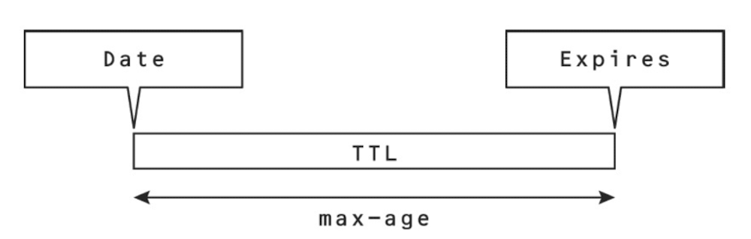
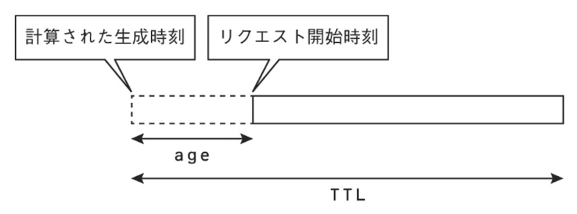

### その他の重要ヘッダー

| ヘッダー名 | 意味 | 例 |
|:---|:---|:---|
| **`Vary`** | **キャッシュキーに含めるリクエストヘッダー**を指定。これが違えば別のキャッシュとして扱われる。 | `Vary: Accept-Encoding, Accept-Language` |
| **`Pragma`** | 古い`no-cache`（HTTP/1.0）。後方互換性のため残っている。 | `Pragma: no-cache` |

**`Vary`ヘッダーの使い道：キャッシュを「グループ化」する**

`Vary`ヘッダーは、CDNやブラウザなどのキャッシュサーバーに対して、__「URLが同じでも、このヘッダーの値が違ったら、別々のキャッシュとして保存（グループ化）してね」__ と指示するものです。

#### なぜグループ化が必要か？

もし`Vary`がないと、キャッシュはURLだけを見て「同じだ」と判断し、最初の一種類しか保存しません。

**例：`Vary`がない場合の失敗**

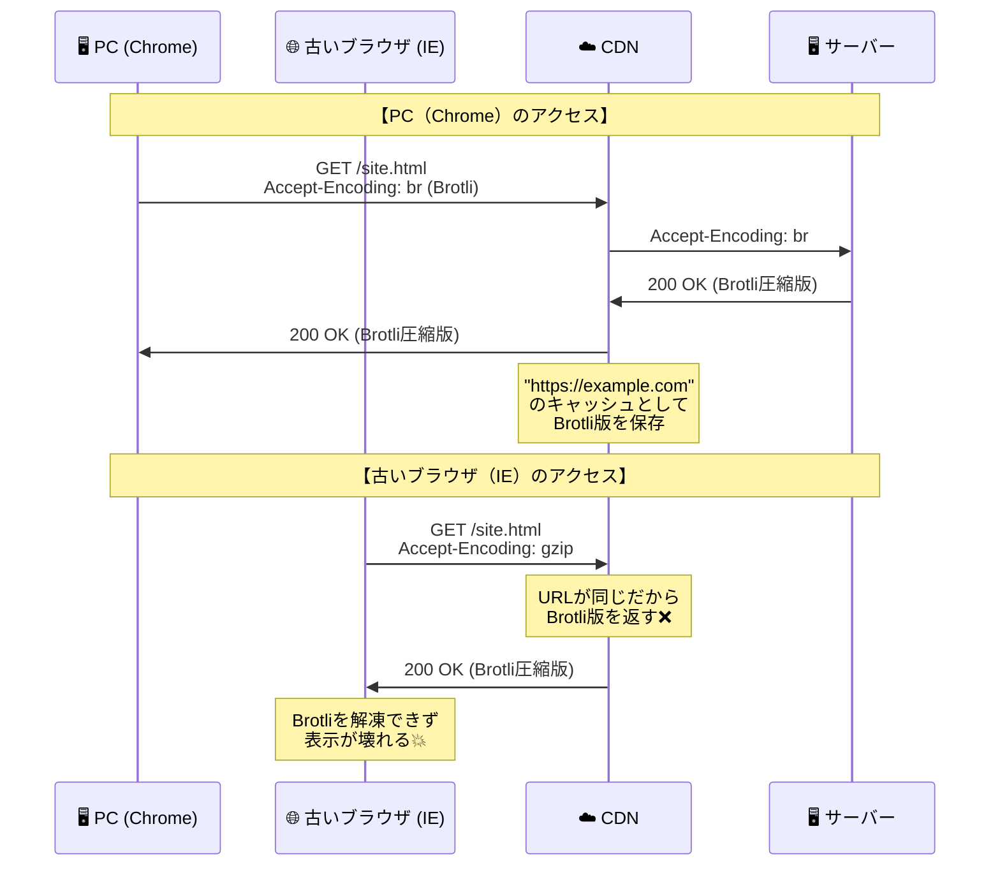
```mermaid
sequenceDiagram
    participant PC as 🖥️ PC (Chrome)
    participant IE as 🌐 古いブラウザ (IE)
    participant CDN as ☁️ CDN
    participant Server as 🖥️ サーバー

    Note over PC, Server: 【PC（Chrome）のアクセス】
    PC->>CDN: GET /site.html<br>Accept-Encoding: br (Brotli)
    CDN->>Server: Accept-Encoding: br
    Server->>CDN: 200 OK (Brotli圧縮版)
    CDN->>PC: 200 OK (Brotli圧縮版)
    Note over CDN: "https://example.com"<br>のキャッシュとして<br>Brotli版を保存

    Note over PC, Server: 【古いブラウザ（IE）のアクセス】
    IE->>CDN: GET /site.html<br>Accept-Encoding: gzip
    Note over CDN: URLが同じだから<br>Brotli版を返す❌
    CDN->>IE: 200 OK (Brotli圧縮版)
    Note over IE: Brotliを解凍できず<br>表示が壊れる💥
```

#### `Vary`がある場合の正しい動作

サーバーが`Vary: Accept-Encoding`というレスポンスヘッダーを付けていた場合：

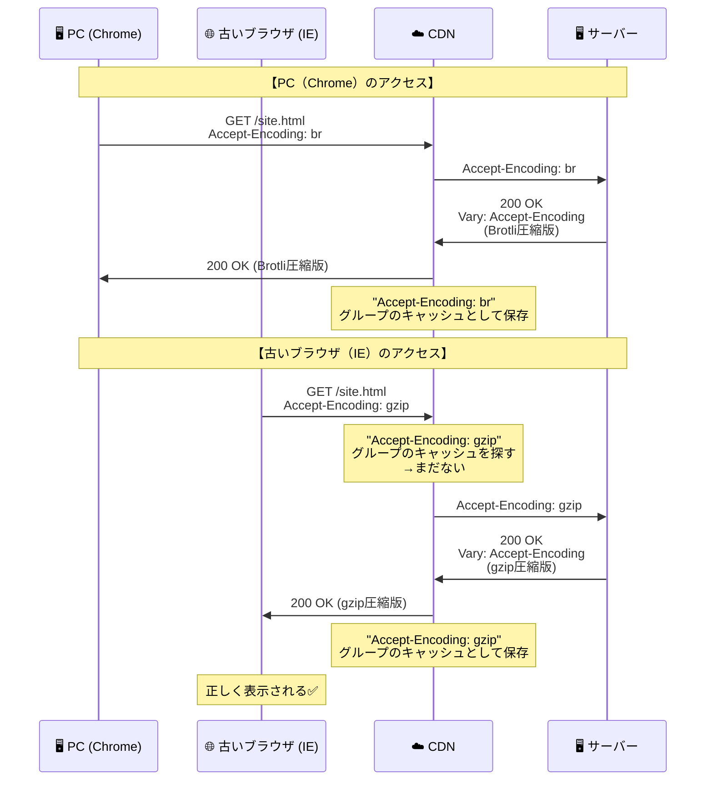
```mermaid
sequenceDiagram
    participant PC as 🖥️ PC (Chrome)
    participant IE as 🌐 古いブラウザ (IE)
    participant CDN as ☁️ CDN
    participant Server as 🖥️ サーバー

    Note over PC, Server: 【PC（Chrome）のアクセス】
    PC->>CDN: GET /site.html<br>Accept-Encoding: br
    CDN->>Server: Accept-Encoding: br
    Server->>CDN: 200 OK<br>Vary: Accept-Encoding<br>(Brotli圧縮版)
    CDN->>PC: 200 OK (Brotli圧縮版)
    Note over CDN: "Accept-Encoding: br"<br>グループのキャッシュとして保存

    Note over PC, Server: 【古いブラウザ（IE）のアクセス】
    IE->>CDN: GET /site.html<br>Accept-Encoding: gzip
    Note over CDN: "Accept-Encoding: gzip"<br>グループのキャッシュを探す<br>→まだない
    CDN->>Server: Accept-Encoding: gzip
    Server->>CDN: 200 OK<br>Vary: Accept-Encoding<br>(gzip圧縮版)
    CDN->>IE: 200 OK (gzip圧縮版)
    Note over CDN: "Accept-Encoding: gzip"<br>グループのキャッシュとして保存
    Note over IE: 正しく表示される✅
```

こうすることで、**URLが同じでも、圧縮形式ごと（brグループ、gzipグループ）にキャッシュが正しくグループ化**されます。

#### よくある`Vary`の指定

| `Vary`の値 | 使用例 | グループ化の内容 |
|:---|:---|:---|
| **`Accept-Encoding`**（最重要） | 圧縮対応サイト | gzip, br など、圧縮形式ごとにキャッシュを分ける |
| **`User-Agent`** | レスポンシブデザイン（非推奨） | PC用ページとスマートフォン用ページでキャッシュを分ける<br>⚠️ User-Agentは種類が多すぎるので、キャッシュヒット率が激減する |
| **`Accept-Language`** | 多言語サイト | 日本語ページ（ja）と英語ページ（en）でキャッシュを分ける |

**具体例**:
```http
Vary: Accept-Encoding, Accept-Language
```
→ 「圧縮形式」×「言語」のマトリクスでキャッシュがグループ化される

```
グループ1: Accept-Encoding: gzip, Accept-Language: ja → 日本語・gzip版
グループ2: Accept-Encoding: br, Accept-Language: ja → 日本語・Brotli版
グループ3: Accept-Encoding: gzip, Accept-Language: en → 英語・gzip版
グループ4: Accept-Encoding: br, Accept-Language: en → 英語・Brotli版
```

⚠️ **注意**: `Vary`に指定するヘッダーが多すぎると、キャッシュの組み合わせが爆発的に増え、**キャッシュヒット率が下がってしまいます**。本当に必要なものだけを指定しましょう。

-----

## 9\. 実践！シチュエーション別キャッシュ設定（クイズ形式）

ここからは、クイズ形式で学びましょう！各シチュエーションで**どんなヘッダーを返すべきか**考えてから、答えをクリックして確認してください。

### 🎨 **1. 静的な画像・CSS・JSファイル（バージョニング済み）**

**状況**: `app.v3.2.1.js`のようにファイル名にバージョンが入っている静的アセット。

**問題**: 以下の空欄を埋めてください。
```http
Cache-Control: public, max-age=31536000, ________
Date: Wed, 21 Oct 2025 07:28:00 GMT
ETag: "abc123def456"
```

<details>
<summary>💡 答えを見る（クリックして展開）</summary>

**正解**:
```http
Cache-Control: public, max-age=31536000, immutable
Date: Wed, 21 Oct 2025 07:28:00 GMT
ETag: "abc123def456"
```

**解説**:
- `public`: CDNやプロキシでも共有キャッシュOK
- `max-age=31536000`（1年）: ブラウザとCDNに長期保存
- `immutable`: リロード時もサーバー確認なし！超高速！
- ファイル名が変われば別ファイル扱いなので、古いキャッシュの心配なし

</details>

---

### 📄 **2. HTMLファイル（トップページ、記事ページ）**

**状況**: ページの内容が更新される可能性があるHTML。

**問題**: 以下の空欄を埋めてください。
```http
Cache-Control: ________
Date: Wed, 21 Oct 2025 07:28:00 GMT
ETag: "xyz789abc123"
Last-Modified: Wed, 21 Oct 2025 06:00:00 GMT
```

<details>
<summary>💡 答えを見る（クリックして展開）</summary>

**正解**:
```http
Cache-Control: no-cache
Date: Wed, 21 Oct 2025 07:28:00 GMT
ETag: "xyz789abc123"
Last-Modified: Wed, 21 Oct 2025 06:00:00 GMT
```

**解説**:
- `no-cache`: 毎回サーバーに確認。常に最新のHTMLを表示できる
- `ETag`と`Last-Modified`の両方を付けておくと、古いブラウザにも対応できて安心
- 更新がなければ`304 Not Modified`で通信量を節約

</details>

---

### 🔒 **3. ログイン後のユーザー情報API**

**状況**: `/api/me`のような個人情報を返すエンドポイント。

**問題**: 以下の空欄を埋めてください。
```http
Cache-Control: ________, ________
Date: Wed, 21 Oct 2025 07:28:00 GMT
```

<details>
<summary>💡 答えを見る（クリックして展開）</summary>

**正解**:
```http
Cache-Control: private, no-store
Date: Wed, 21 Oct 2025 07:28:00 GMT
```

**解説**:
- `private`: CDNやプロキシにキャッシュさせない
- `no-store`: ブラウザにも保存させない。個人情報の漏洩を防ぐ！
- クレジットカード情報や医療情報など、機密性の高いデータには必須

</details>

---

### 📰 **4. ニュースサイトのトップページ**

**状況**: 頻繁に更新されるが、数秒古くても許容できる。__ユーザー体験優先__。

**問題**: 以下の空欄を埋めてください。
```http
Cache-Control: public, ________=60, ________=300
Date: Wed, 21 Oct 2025 07:28:00 GMT
ETag: "news20251021v1"
```

<details>
<summary>💡 答えを見る（クリックして展開）</summary>

**正解**:
```http
Cache-Control: public, max-age=60, stale-while-revalidate=300
Date: Wed, 21 Oct 2025 07:28:00 GMT
ETag: "news20251021v1"
```

**解説**:
- `max-age=60`: 1分間はそのまま使える
- `stale-while-revalidate=300`: 1分〜6分の間は**古いキャッシュをすぐ表示しつつ、裏でこっそり更新**。ユーザーを待たせない！
- アクセスが多い時間帯でもサーバー負荷を抑えられる

</details>

---

### ☁️ **5. CDN経由の大容量動画ファイル**

**状況**: YouTube風の動画配信。ブラウザでは短く、CDNでは長くキャッシュしたい。

**問題**: 以下の空欄を埋めてください。
```http
Cache-Control: public, ________=3600, ________=2592000
Date: Wed, 21 Oct 2025 07:28:00 GMT
ETag: "video123hash"
```

<details>
<summary>💡 答えを見る（クリックして展開）</summary>

**正解**:
```http
Cache-Control: public, max-age=3600, s-maxage=2592000
Date: Wed, 21 Oct 2025 07:28:00 GMT
ETag: "video123hash"
```

**解説**:
- `max-age=3600`（1時間）: ブラウザキャッシュは短めに
- `s-maxage=2592000`（30日）: CDNには長期保存。オリジンサーバーへのリクエストが激減！
- CDNのエッジサーバーから高速配信できるので、世界中どこからでも快適

</details>

---

### 📊 **6. ダッシュボードのリアルタイムデータ**

**状況**: `/api/dashboard/stats`のような、常に最新であるべきAPI。

**問題**: 以下の空欄を埋めてください。
```http
Cache-Control: ________
Date: Wed, 21 Oct 2025 07:28:00 GMT
ETag: "stats-1634803680"
```

<details>
<summary>💡 答えを見る（クリックして展開）</summary>

**正解**:
```http
Cache-Control: no-cache
Date: Wed, 21 Oct 2025 07:28:00 GMT
ETag: "stats-1634803680"
```

**解説**:
- `no-cache`: 毎回鮮度確認。古いデータを表示しない
- `must-revalidate`: キャッシュ期限切れ後の古いデータ使用を完全ブロック。若干冗長だが、CDNの解釈が誤っている場合やブラウザが古い場合もあるため、念のために入れていた方が安全ではある。
- `ETag`で変更がなければ`304`で軽量に応答。リアルタイム性と効率を両立

</details>

---

### 🎯 **7. APIレスポンス（短期キャッシュOK）**

**状況**: `/api/products`のような商品一覧。数分は古くてもOK。言語によってキャッシュを分けたい。

**問題**: 以下の空欄を埋めてください。
```http
Cache-Control: public, max-age=600, ________
Date: Wed, 21 Oct 2025 07:28:00 GMT
ETag: "products-v42"
Vary: ________
```

<details>
<summary>💡 答えを見る（クリックして展開）</summary>

**正解**:
```http
Cache-Control: public, max-age=300, must-revalidate
Date: Wed, 21 Oct 2025 07:28:00 GMT
ETag: "products-v42"
Vary: Accept-Language
```

**解説**:
- `max-age=300`（5分）: 短期キャッシュ。商品情報の更新にも追従しやすい
- `must-revalidate`: 期限切れ後は必ず確認。なくてもキャッシュ切れの場合にはオリジンへ確認するが、その確認が失敗した時に、古いキャッシュという保険の利用を許すか、許さないかを決める。
- `Vary: Accept-Language`: 言語別にキャッシュ。日本語版と英語版を別管理
- 同じ言語の複数ユーザーでキャッシュを共有できて効率的！

</details>

---

### 🚨 **8. 障害時も表示したいコンテンツ（高可用性重視）**

**状況**: サービス紹介ページなど、万が一サーバーが落ちても表示したい。

**問題**: 以下の空欄を埋めてください。
```http
Cache-Control: public, max-age＝600, ________=86400
Date: Wed, 21 Oct 2025 07:28:00 GMT
ETag: "service-page-v5"
```

<details>
<summary>💡 答えを見る（クリックして展開）</summary>

**正解**:
```http
Cache-Control: public, max-age=600, stale-if-error=86400
Date: Wed, 21 Oct 2025 07:28:00 GMT
ETag: "service-page-v5"
```

**解説**:
- `max-age=600`（10分）: 通常時のキャッシュ
- `stale-if-error=86400`（24時間）: サーバーエラー時は古いキャッシュを表示
- 障害が起きても「ページが見れない！」を防げる。BCP（事業継続計画）に有効

</details>

---

### 🔐 **9. 二段階認証トークンのAPIレスポンス**

**状況**: ワンタイムパスワードや認証トークンを返すAPI。

**問題**: 以下の空欄を埋めてください。
```http
Cache-Control: ________, ________, ________, ________
Pragma: no-cache
Expires: 0
Date: Wed, 21 Oct 2025 07:28:00 GMT
```

<details>
<summary>💡 答えを見る（クリックして展開）</summary>

**正解**:
```http
Cache-Control: private, no-store, no-cache, must-revalidate
Pragma: no-cache
Expires: 0
Date: Wed, 21 Oct 2025 07:28:00 GMT
```

**解説**:
- `no-store`: どこにも保存させない
- `private`: 共有キャッシュを完全禁止
- `no-cache`: 使用前に必ず確認
- `must-revalidate`: 期限切れ後の使用を禁止
- `Pragma: no-cache`と`Expires: 0`: 古いブラウザ対策も万全
- セキュリティ最優先！トークンの漏洩や再利用を完全ブロック

</details>

-----

## 10\. 知っておきたい注意点

  * **キャッシュは満席になったら追い出される**: `max-age`で1年と指定しても、キャッシュサーバーの容量が一杯になれば、**人気のないファイルは消されてしまいます**。
  * **`max-age`のカウントダウンはリクエスト時に始まる**: サーバーがレスポンスを作った時ではなく、**ブラウザがリクエストした瞬間**からカウントが始まります。
  * **`Age`ヘッダー**: CDNを経由したキャッシュには、CDNに置かれていた時間を示す`Age`ヘッダーが付きます。ブラウザがキャッシュできる残りの時間は `max-age` - `Age` となります。

## 参考資料
### キャッシュ可否のフロー
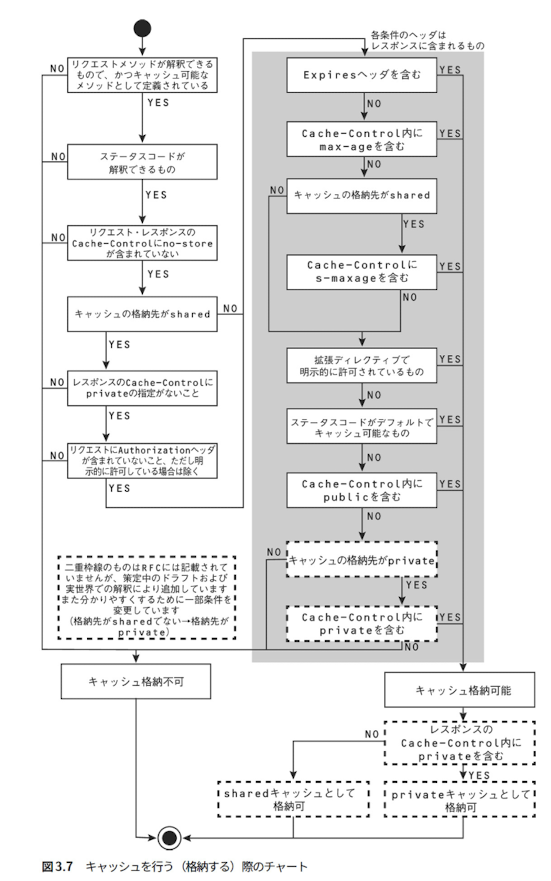